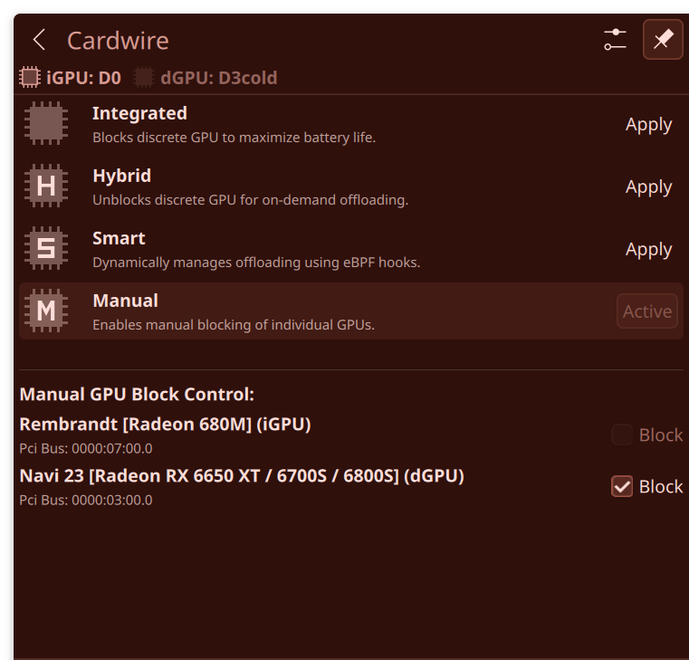
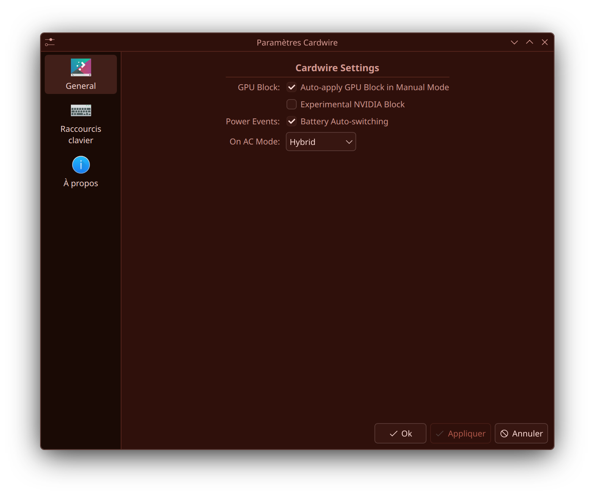

# cardwire-plasmoid

A KDE Plasma 6 system tray widget to monitor and switch GPU modes using `cardwire`.

## Disclaimer

> This project has been vibe-coded but I've taken great care to ensure that everything makes sense. I'm not well versed in kde widget development and cpp programming. I'm open to criticism and suggestions. Feel free to open an issue or submit a pr.

## Features

- **Toggle Modes:** Switch between **Integrated**, **Hybrid**, **Smart**, and **Manual** modes right from your system tray.
- **Dynamic Icons:** The tray icon changes color/variant depending on which mode is active and whether your dedicated GPU is awake (`D0`) or suspended (`D3cold`).
- **Native Settings:** Access configuration options like `auto_apply_gpu_state` and `battery_auto_switch` from the standard Plasma widget settings.
- **Lightweight:** Spawns asynchronous queries with a 2-second interval, and reads power states directly from sysfs to avoid lag or waking up your GPU.

<p align="center">
  
  
</p>

## Installation

### Arch Linux

Use the provided `PKGBUILD` to build and install the widget:

```bash
makepkg -si
```

### Other Distributions (CMake)

For other distributions running KDE Plasma 6 (like Fedora, openSUSE, or Kubuntu/KDE Neon), you can build and install manually using CMake.

#### 1. Install Build Dependencies
Ensure you have `cmake`, `extra-cmake-modules` (ECM), and development headers for `Qt6` (Qml, Gui, Core, DBus), `KF6` (Config, I18n, Solid), and `libplasma` installed:

* **Fedora:**
  ```bash
  sudo dnf install cmake extra-cmake-modules kf6-kconfig-devel kf6-kcoreaddons-devel kf6-ki18n-devel kf6-solid-devel libplasma-devel qt6-qtbase-devel qt6-qtdeclarative-devel gcc-c++ gettext
  ```
* **Ubuntu / Debian / KDE Neon:**
  ```bash
  sudo apt install cmake extra-cmake-modules libkf6config-dev libkf6i18n-dev libkf6solid-dev libplasma-dev qt6-base-dev qt6-declarative-dev g++ gettext
  ```

#### 2. Build and Install
Run the following commands in the repository root directory:

```bash
cmake -B build -S . -DCMAKE_BUILD_TYPE=Release -DCMAKE_INSTALL_PREFIX=/usr
cmake --build build
sudo cmake --install build
```

## Notes

- Make sure the `cardwired` systemd service is active before launching.
- Since it relies on `cardwire`, this widget requires Wayland.
