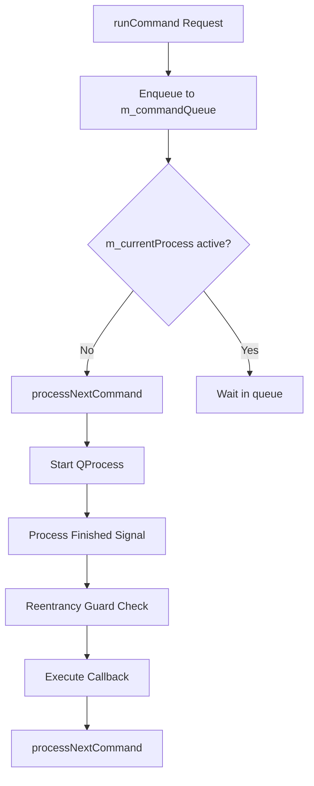

# Cardwire Plasmoid Architecture

This document describes the inner workings and design decisions behind the [cardwire-plasmoid](file:///home/mixcraftio/Code/Repos/GPU/cardwire-plasmoid) C++ backend and QML user interface.

---

## 1. Asynchronous Subprocess Execution Queue

To avoid locking up the KDE Plasma GUI thread when querying `cardwired` daemon states, the widget communicates with the daemon entirely by running the `cardwire` CLI utility as a subprocess via `QProcess`.

Subprocess management is coordinated inside [DaemonController](file:///home/mixcraftio/Code/Repos/GPU/cardwire-plasmoid/src/DaemonController.h):



### Key Elements:
* **Sequential Queue:** Commands are enqueued in `m_commandQueue` as `CommandRequest` structs containing arguments and callback handlers. This guarantees that only one `QProcess` is active at any time, preventing resource exhaustion and race conditions.
* **Reentrancy Protection:** The coordinator captures the active process pointer inside the finish callback lambda and updates the queue status safely. If a callback triggers a nested `runCommand` (for example, fetching status right after setting a configuration), it enqueues correctly without overwriting active process state or causing segmentation faults.
* **Low-Overhead Polling:** The 2-second periodic timer in `pollDaemon()` only queries status and active mode. Individual configuration values and the full GPU list are queried only once during startup or when the daemon reconnects.

---

## 2. Dynamic Hardware Readings (sysfs)

Rather than running multiple shell commands or subprocesses to monitor GPU power states (which can take a few hundred milliseconds and degrade battery life), the widget reads directly from the Linux kernel sysfs tree:

```cpp
QFile powerFile(QStringLiteral("/sys/bus/pci/devices/%1/power_state").arg(pci));
if (powerFile.open(QIODevice::ReadOnly | QIODevice::Text)) {
    powerState = QString::fromUtf8(powerFile.readAll()).trimmed();
}
```

This direct read completes in microseconds and allows the widget to keep power states (such as `D0` active or `D3cold` suspended) updated instantly on every poll with zero CPU overhead.

---

## 3. QML Layout Bindings

The user interface uses [main.qml](file:///home/mixcraftio/Code/Repos/GPU/cardwire-plasmoid/src/package/contents/ui/main.qml) to render settings and status.

* **In-place GPU Updates:** The [DaemonController](file:///home/mixcraftio/Code/Repos/GPU/cardwire-plasmoid/src/DaemonController.cpp) matches GPU devices by their IDs. It updates the existing [CardwireGpu](file:///home/mixcraftio/Code/Repos/GPU/cardwire-plasmoid/src/CardwireGpu.h) objects instead of recreating them on every poll. This prevents QML from tearing down and rebuilding delegates, eliminating layout shifts and flickering.
* **Layout Loop Solution:** The mode list delegate uses `implicitHeight` with explicit top/left/right anchors instead of `height` or `anchors.fill: parent`. This allows the layout engine to calculate wrapped description text heights dynamically without circular dependencies.
